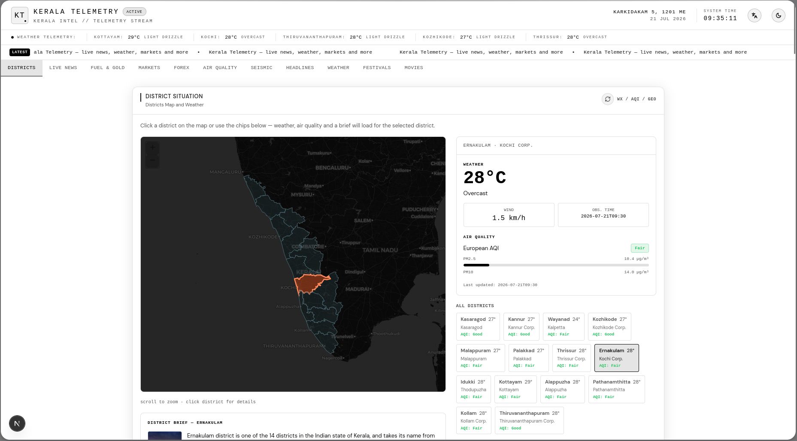
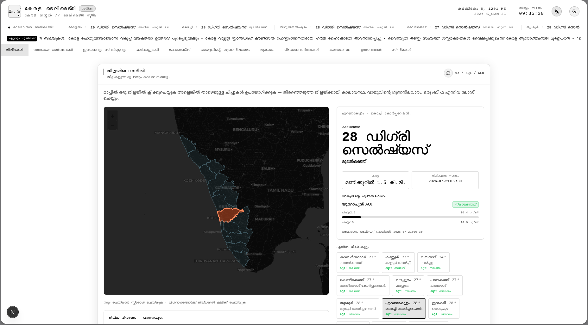
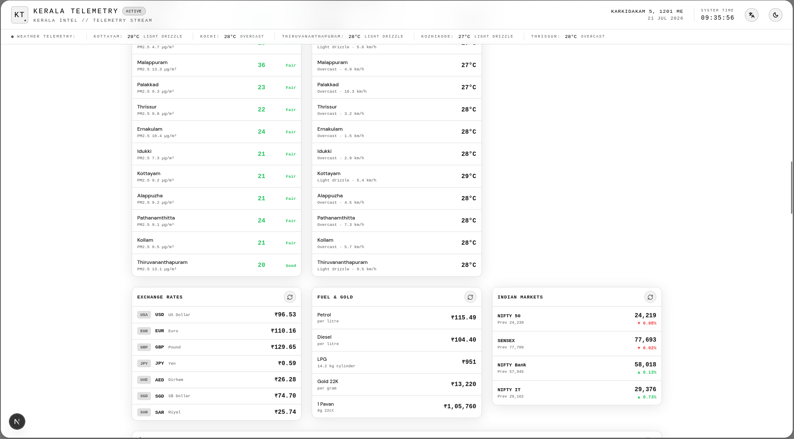
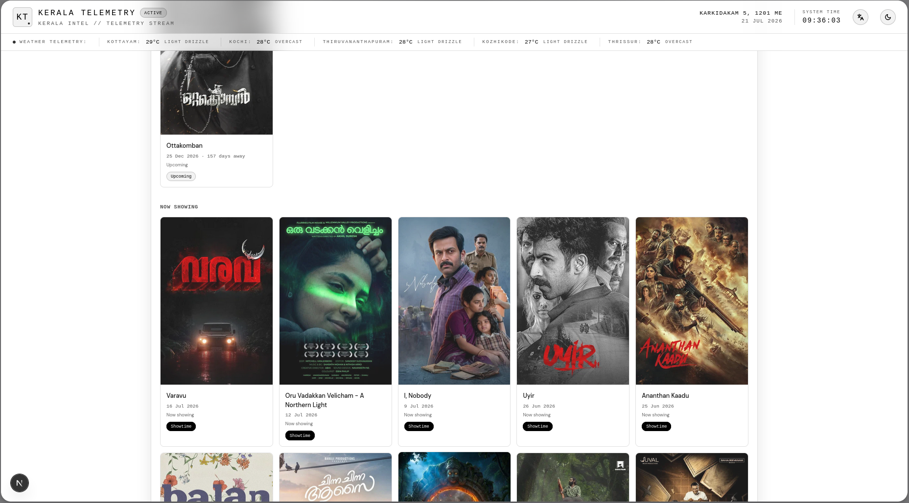
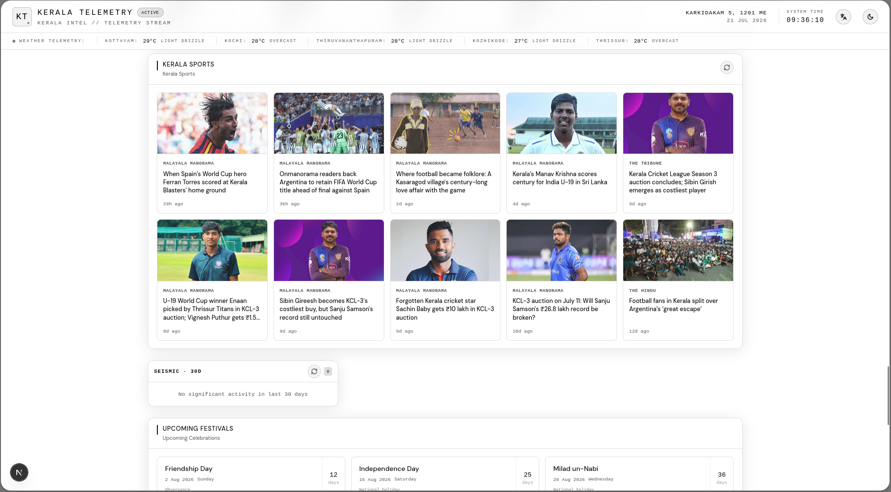
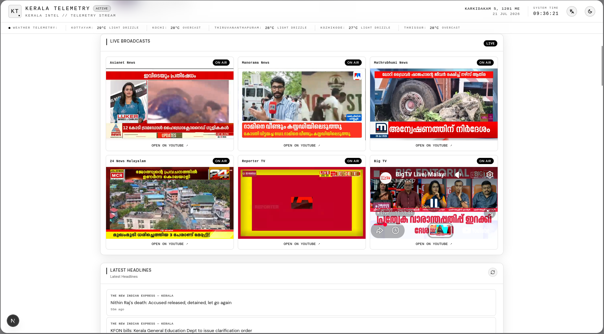

# Kerala Telemetry

A real-time regional intelligence dashboard for Kerala — aggregating weather, air quality, financial markets, forex rates, fuel and gold prices, seismic activity, news, live TV, Malayalam movies, festivals, sports, and interactive district maps into a **single-page command center**.

[](https://nextjs.org)
[](https://react.dev)
[](https://www.typescriptlang.org)
[](https://tailwindcss.com)
[](./LICENSE)

<p align="center">
  
</p>

---

## Why Kerala Telemetry?

Kerala is a narrow coastal strip bordered by the Western Ghats — prone to monsoons, floods, landslides, and seismic activity, while also having a vibrant economy, active financial markets, a thriving film industry, and deep cultural traditions. There is no single place that brings all of this together in real time. **Kerala Telemetry solves that.**

### Key Benefits

- **Real-time** — panels refresh independently (3 min for news, 5 min for markets, 10 min for weather, etc.)
- **Malayalam support** — full page translation via Google Translate, Malayalam fonts, and Kollavarsham calendar
- **Resilient data** — multi-tier fallback chains keep the dashboard working when APIs are down
- **Zero API keys for core features** — weather, AQI, forex, earthquakes, news all work out of the box
- **District-level granularity** — interactive map with per-district weather, AQI, and Wikipedia summaries for all 14 districts
- **Breaking news alerts** — automatic detection of alert keywords with a "BREAKING" ticker
- **Single-page architecture** — smooth-scroll navigation with scroll-spy highlighting

---

## Dashboard

The dashboard is a single scrollable page with **13 sections**, each independently refreshing.

### Interactive District Map

An interactive **Leaflet GeoJSON map** on a dark CARTO basemap. Click any district or use the chip buttons below to select it. The panel shows weather, air quality, and a Wikipedia summary for the selected district.

All 14 districts: Thiruvananthapuram, Kollam, Pathanamthitta, Alappuzha, Kottayam, Idukki, Ernakulam, Thrissur, Palakkad, Malappuram, Kozhikode, Wayanad, Kannur, Kasaragod.

<p align="center">
  
</p>

### Live Broadcasts & Headlines

Embedded **YouTube live streams** from 6 major Malayalam news channels (Asianet News, Manorama News, Mathrubhumi News, 24 News, Reporter TV, Big TV) alongside a real-time **RSS news aggregator** pulling from The Hindu Kerala and New Indian Express Kerala — merged, deduplicated, and sorted with relative timestamps. A scrolling **news ticker** at the top auto-detects alert keywords (flood, cyclone, earthquake, etc.) and shows a red "BREAKING" badge when triggered.

<p align="center">
  
</p>

### Weather, Air Quality & Earthquakes

Real-time data for all 14 Kerala cities from the **Open-Meteo API**: temperature, weather condition, wind speed, European AQI, PM2.5, PM10. **USGS seismic monitoring** covers ~300 km around Kerala (magnitude 1.0+, last 30 days), color-coded by severity.

### Markets, Forex & Fuel/Gold

Live **Indian stock indices** (NIFTY 50, SENSEX, NIFTY Bank, NIFTY IT) from Yahoo Finance. **Forex rates** for 7 currencies (USD, EUR, GBP, JPY, AED, SGD, SAR) against INR. Kerala-specific **fuel and gold prices** (petrol, diesel, LPG, gold 22K per gram and per pavan) scraped from GoodReturns.in with multi-tier fallback.

<p align="center">
  
</p>

### Malayalam Movies & Kerala Sports

Current and upcoming **Malayalam film releases** from the Watchmode API — distinguishing theatrical ("Showtime") vs OTT releases with poster images and countdowns. A dedicated **Kerala sports news** feed covering Kerala Blasters FC, Super League Kerala, Kerala Cricket, and Santosh Trophy.

<p align="center">
  
</p>

### Upcoming Festivals

**Kerala festival calendar** with countdowns — three-tier data source: Calendarific API (Kerala-specific), Nager.Date API (Indian public holidays), and hardcoded fallback for 10 major Kerala festivals for 2026.

<p align="center">
  
</p>

---

## Tech Stack

| Layer | Technology |
|---|---|
| Framework | **Next.js 16** (App Router, Turbopack, Server Components) |
| Language | **TypeScript 5** (strict mode) |
| UI | **React 19** / **Tailwind CSS v4** |
| State/Data | **TanStack React Query v5** |
| Mapping | **Leaflet 1.9** + **react-leaflet 5** |
| RSS | **rss-parser 3.13** |
| Icons | **lucide-react** |
| Fonts | DM Sans, Playfair Display, Noto Serif/Sans Malayalam |
| Build | **Bun** (primary) / npm (fallback) |

---

## Data Sources

| Source | Purpose | Key |
|---|---|---|
| [Open-Meteo](https://open-meteo.com) | Weather & air quality (14 cities) | None |
| [USGS](https://earthquake.usgs.gov) | Earthquakes near Kerala | None |
| [Open Exchange Rates](https://open.er-api.com) | Forex (7 currencies vs INR) | None |
| [Yahoo Finance](https://finance.yahoo.com) | Indian market indices | None (unofficial) |
| [GoodReturns.in](https://goodreturns.in) | Kerala fuel & gold prices | None (scraping) |
| [Watchmode](https://www.watchmode.com) | Malayalam movie listings | `WATCHMODE_API_KEY` |
| [Calendarific](https://calendarific.com) | Kerala festival calendar | `CALENDARIFIC_API_KEY` |
| [Nager.Date](https://date.nager.at) | Indian public holidays (fallback) | None |
| RSS (The Hindu / New Indian Express) | Kerala news headlines | None |
| [NewsAPI](https://newsapi.org) / [GNews](https://gnews.io) | Kerala sports news | `NEWSAPI_API_KEY` / `GNEWS_API_KEY` |
| [Wikipedia](https://en.wikipedia.org) | District summaries | None |
| [YouTube](https://youtube.com) | Live Malayalam news streams | None |

**Most core features require zero API keys.** Only movie listings, festival calendar (for best coverage), and sports news benefit from optional keys.

---

## API Routes

All routes in `src/app/api/` with `force-dynamic` rendering:

| Route | Description |
|---|---|
| `GET /api/aqi` | Air quality for all 14 Kerala cities |
| `GET /api/earthquakes` | USGS earthquake data within Kerala region |
| `GET /api/forex` | Exchange rates (7 currencies to INR) |
| `GET /api/markets` | Indian stock market indices |
| `GET /api/news` | Aggregated RSS news (`?limit=N`) |
| `GET /api/retail-rates` | Scraped fuel and gold prices |
| `GET /api/movies` | Malayalam movie listings |
| `GET /api/festivals` | Festival/holiday calendar |
| `GET /api/sports` | Kerala sports news |
| `GET /api/wiki-district` | Wikipedia summary (`?district=X`) |

---

## Auto-Refresh Intervals

| Panel | Interval |
|---|---|
| News Headlines | 3 min |
| News Ticker | 5 min |
| Markets | 5 min |
| Weather / Air Quality | 10 min |
| Earthquakes | 15 min |
| Sports | 30 min |
| Forex / Festivals | 60 min |
| Fuel & Gold | 8 hours (cached) |
| Movies | 24 hours (cached) |

---

## Project Structure

```
src/
├── app/
│   ├── layout.tsx              # Root layout: fonts, Google Translate, QueryProvider
│   ├── page.tsx                # Single page: assembles all dashboard sections
│   ├── globals.css             # Global styles, CSS variables, animations
│   └── api/                    # Server-side API routes (10 endpoints)
├── config/
│   ├── kerala-cities.ts        # 14 districts with lat/lon coordinates
│   └── sources.ts              # YouTube channels, RSS feed URLs
├── features/
│   ├── markets/                # Forex, fuel, gold, Indian indices
│   ├── media/                  # News aggregator, live broadcasts, sports
│   ├── telemetry/              # Regional map, seismic activity
│   └── weather/                # Air quality, city weather
├── lib/
│   ├── weather.ts              # WMO weather code mapping
│   ├── news.ts / news-emoji.ts # News types and emoji classifier
│   ├── youtube.ts              # YouTube URL parsing
│   ├── retail-rates.ts         # RetailRatesPayload type
│   └── server/                 # Server-only data fetchers
└── shared/
    ├── QueryProviders.tsx       # TanStack React Query provider
    └── ui/
        ├── dashboard/           # DashboardPanel, refresh buttons
        └── layout/              # SiteHeader, AlertBanner, MainNavigation
```

---

## Setup

```bash
git clone https://github.com/TimsTittus/Kerala-Telemetry.git
cd Kerala-Telemetry
bun install          # or npm install
cp .env.example .env # add optional API keys if desired
bun dev              # or npm run dev
```

Open [http://localhost:3000](http://localhost:3000).

### Environment Variables

| Variable | Required | Description |
|---|---|---|
| `WATCHMODE_API_KEY` | Optional | Malayalam movie listings |
| `CALENDARIFIC_API_KEY` | Optional | Kerala-specific festival calendar |
| `NEWSAPI_API_KEY` | Optional | Kerala sports news (NewsAPI) |
| `GNEWS_API_KEY` | Optional | Kerala sports news (GNews) |
| `NEXT_PUBLIC_APP_URL` | Optional | Base URL for self-fetch API calls |

---

## Design & Accessibility

**Design** — Command-center aesthetic with a dark theme (default), light theme toggle, "Kasavu" design references (`.kt-kasavu`, `.kt-cream`, `.kt-gold`), smooth scroll-spy navigation, and responsive layout.

**Accessibility** — `prefers-reduced-motion` support, ARIA labels, focus-visible outlines, semantic HTML.

**Security** — `X-Content-Type-Options: nosniff`, `X-Frame-Options: DENY`, `Referrer-Policy: strict-origin-when-cross-origin`, `Strict-Transport-Security`.

---

## License

MIT